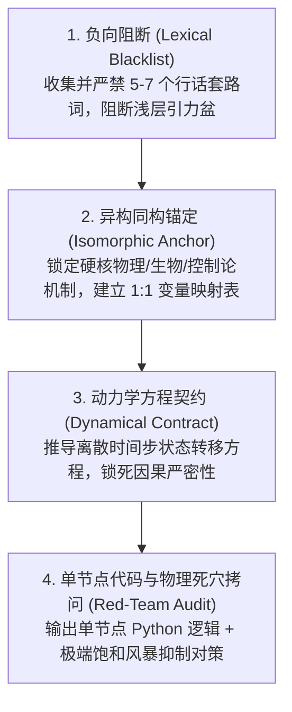

# 潜空间跨界激活器 (Latent Space Activator)

> **使命**：在不依赖外部重资产知识库、不调高模型采样温度（保持 $T=0.0$ 最高确定性）的前提下，通过结构化工程算子强行改变模型的上下文注意力引力场，稳定激发大模型自身的跨学科潜空间，输出超越套话的非对称破局洞见与可落地代码。

---

## 核心机制：四重工程激发算子 (The Quad-Operator Flow)

当识别到用户处于“技术定势死锁”、“需要跨界脑暴”、“寻求全新系统范式”或明确要求“激发潜空间/跨学科同构”时，执行以下四重算子流水线：



---

## 阶段一：算子装配指引

### 1. 负向阻断算子（Lexical Blacklist）
- **动作**：快速审视当前问题所属领域，提炼出 5~7 个最容易导致模型“人云亦云”的默认词汇并强制拉黑。
- **示例**：
  - *分布式系统*：拉黑【心跳、轮询、超时重试、Gossip、中心协调、选举、广播】
  - *系统性能排查*：拉黑【增加缓存、读写分离、扩容、增加机器、分库分表】
  - *高并发锁竞争*：拉黑【乐观锁、悲观锁、分布式锁、Redis、Redlock】

### 2. 异构同构锚定算子（Isomorphic Anchor）
- **动作**：从真实自然物理系统中选取一个机制具备数学自洽性的源领域，严禁文学化比喻，必须强制输出**“物理变量 1:1 对应表”**。
- **常见高价值锚定领域库**：
  - **分子生物与免疫学**：抗原呈递、趋化性梯度扩散（Chemotaxis）、局部免疫耐受、细胞自噬（Autophagy）；
  - **非平衡态统计物理**：逾渗阈值（Percolation）、自组织临界性（SOC 沙堆模型）、临界减速、阻抗匹配；
  - **非线性动力学与控制论**：李雅普诺夫函数、吸引子重构、极限环震荡、迟滞回线（Hysteresis）；
  - **仿生群体智能**：黏菌网络（Slime Mold）、蚁群信息素挥发、鸟群 Boids 局部对齐规则。

### 3. 动力学方程契约（Dynamical Contract）
- **动作**：严禁模型输出模糊的定性描述，强制要求给出离散差分方程或状态转移逻辑。
- **契约标准**：
  - 必须包含：外力注入项 $S(k)$、局部阻尼/衰减项 $\lambda$、邻域空间扩散项 $D \sum (x_j - x_i)$；
  - 明确系统在无全局协调者情况下的局部收敛条件。

### 4. 代码落地与红队物理死穴拷问（Red-Team Audit）
- **动作**：
  - **代码还原**：编写一个自包含的、单节点（Single-Node）的 Python 类，变量命名直接映射上述物理状态，严禁伪代码空壳；
  - **死穴拷问**：主动攻击该机制的物理脆弱点（例如：正反馈雪崩、梯度消失、饱和风暴、能量耗竭），并给出工程抗畸变抑制策略。

---

## 阶段二：即插即用调用模板 (Template)

在生成推理 Prompt 或组织多模型协作时，使用以下标准骨架：

```markdown
【目标问题】：
[详细阐述面临的深层技术矛盾或架构死锁]

【硬性约束激发算子】：
1. [负向阻断]：在解答中严禁出现以下行业常规套路词汇：[列出 5-7 个套路词]。
2. [异构锚定]：强制将该系统的一级核心矛盾映射为 [物理学 / 分子生物学 / 流体力学 / 控制论] 中的 [具体自然机制名称]。
3. [结构化契约]：
   - 必须先输出【物理变量 1:1 映射表】（物理量 <-> 架构状态）；
   - 必须推导【离散时间步局部状态转移方程】；
   - 必须提供【单节点可运行 Python 逻辑】（class 实现，包含状态更新与转移）；
   - 必须回答该机制面临【物理饱和/梯度消失风暴】时的自愈与阻尼抑制对策。
```

---

## 阶段三：反模式与实证审查清单 (Checklist)

根据 JHOC [`.agents/rules/anti-metaphysical-protocol.md`](file:///g:/JHOC/.agents/rules/anti-metaphysical-protocol.md) 铁律，在输出给用户前必须自我审核：

- [ ] **是否脱离实际搞玄学？**（如果把生物/物理词汇换成纯控制论词汇，逻辑依然自洽吗？严禁出现“量子顿悟/宇宙灵感”等虚词。）
- [ ] **是否给出了物理死穴对策？**（任何自然机制搬到计算机里必有副作用，没有写出抑制策略的一律不合格。）
- [ ] **代码是否真实可运行？**（单节点 Python 代码是否有闭环逻辑？是否有死循环？）
- [ ] **是否守住 JHOC 安全底线？**（方案生成的代码是否符合静态能力封闭，是否尝试派生不可信动态进程？）
